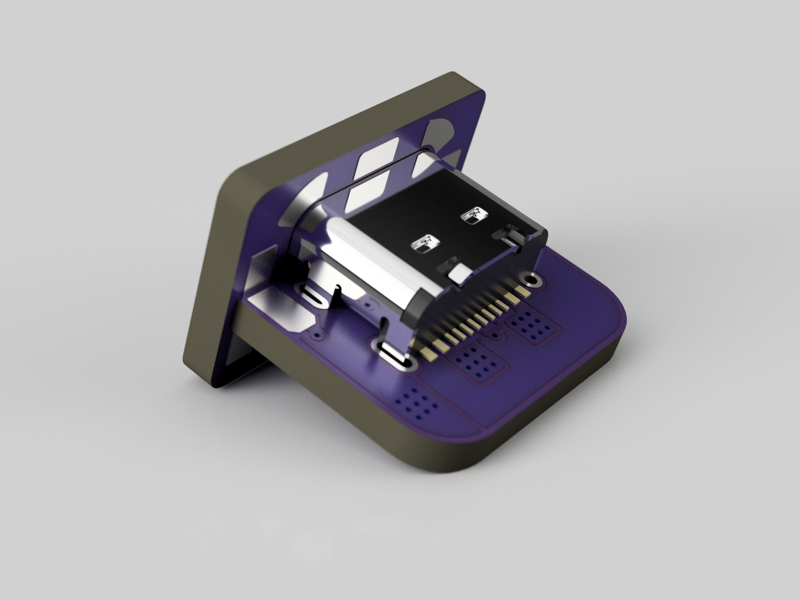

# Type-C Recessed with PD support (And maybe usb 2.0?)
The same concept as https://github.com/Jana-Marie/type-c-recessed with CC and D+/D- pins broken out, (theoretically?) capable of 100W USB PD. 

## How do I use this?
This repo includes the PCB design for the vertical board ([here](https://github.com/Erin-Rose/type-c-recessed-PD/tree/main/Boards/VerticalBoard), as well as a footprint ([here](https://github.com/Erin-Rose/type-c-recessed-PD/tree/main/Footprint)) you can use in your own designs. 

<table>
  <tbody>
    <tr>
      <td>
        
      </td>
      <td>
        
      </td>
    </tr>
  </tbody>
</table>

## Status
Currently untested - this will change in about a week :3

